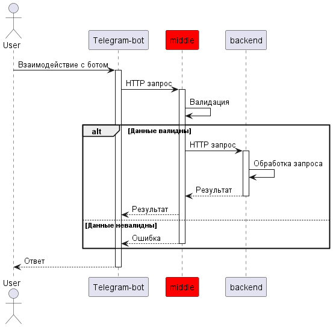
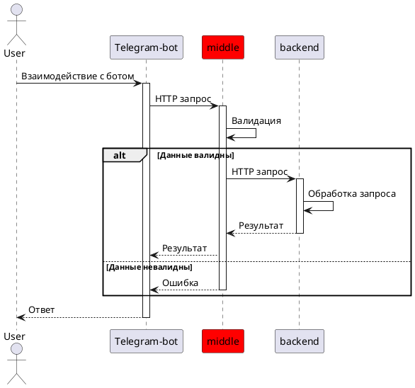

# Middle service

## Описание проекта
Java сервис. Принимает запросы от telegram-бота, выполняет валидацию и бизнес логику, маршрутизирует запросы в "Банк".

## Схема взаимодействия компонентов

## Автор
>**Ветров Сергей**
>- [GitHub](https://github.com/omon4412)
>- [Email](mailto:vetrov241201@yandex.ru)