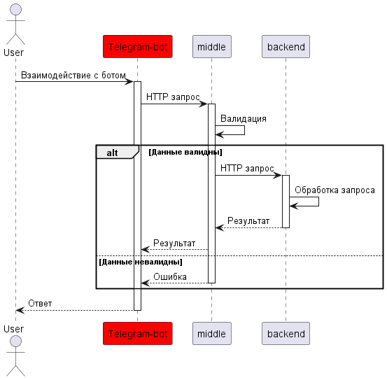
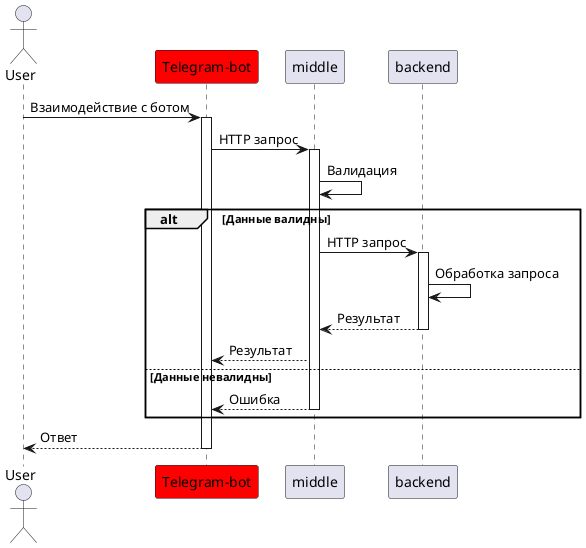

# Мини-банк проект

## Описание проекта
Проект представляет собой телеграм-бота, позволяющего управлять банковскими операциями клиента.

## Структура проекта
### Состоит из трёх компонентов:
- `frontend`: Компонент Telegram-bot. Выступает как клиентское приложение, инициирует запросы пользователей.
- `middle`: Java сервис. Принимает запросы от telegram-бота, выполняет валидацию и бизнес логику, маршрутизирует запросы в "Банк". [Репозиторий](https://github.com/gpb-it-factory/vetrov-middle-service)
- `backend`: Java сервис. Принимает запросы от middle-сервиса. Выступает в качестве АБС (автоматизированная банковская система), обрабатывает транзакции, хранит клиентские данные и т. д.

## Схема взаимодействия компонентов




# Использование
>Список доступных команд:
>- /start - Приветственное сообщение
>- /ping - Получение ответного pong 
>- /register - Регистрация нового клиента
>- /createaccount - Создание нового счёта
>- /currentbalance - Запрос баланса

# Локальный запуск
>Windows:
>```cmd
>gradlew.bat bootRun --args='--bot.token={ваш токен}'
>```

>Linux:
>```bash
>./gradlew bootRun --args='--bot.token={ваш токен}'
>```

>Docker:
>```bash
>docker build -t tgbot .
>docker run --name tgbot -d -e BOT_TOKEN='<ваш токен>' tgbot
>```

## Автор
>**Ветров Сергей**
>- [GitHub](https://github.com/omon4412)
>- [Email](mailto:vetrov241201@yandex.ru)